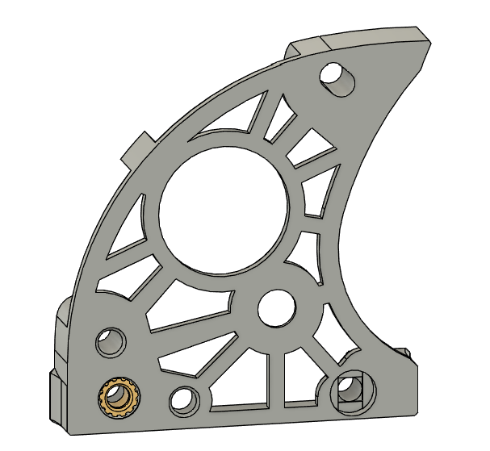

# Sharkfin Extruder
Sharkfin is a lightweight BMG gear based extruder, which uses the Sherpa Mini mounting standard.  This extruder is based on [Sailfin](https://github.com/CroXY3D/Sailfin-Extruder), and the license carries over from there. Sharkfin is made to work in the Voron Printer ecosystem, and draws on that pool of standard parts. It can use standard BMG extruder components, as well as the new RIDGA one piece gear from BMG(my preference). There is an optional front piece with the added mounting ear(shown below), compatible with the [XOL Toolhead](https://github.com/Armchair-Engineering/Xol-Toolhead).  

## What's New
Compared to Sailfin and old Sharkfin, the geometry is fully reworked, inside and out.  On the inside, space was made to install RIDGA, while simultaneously tightening up clearances around the filament path.  I retweaked everything to line up properly with 0.2mm layers(more of a headache than I would have ever expected, due to my own shoddy old work). I also now have a built in support around the filament path. This leads to a much more cleanly printed opening around the drive gears. As for the new exterior look(aka "Stealthfin"), I absolutely asked for outside help.  The mod master himself, @hartk1213, came to my rescue and did a complete stealthification of the sharkfin look.  I then used his work as inspiration for the version you see here.  I outright stole a lot of his lines, and altered some to better suit my own taste.  The result looks pretty darn cool, more due to his work than mine.  Thanks buddy!

## Idler Arms
The three tension arm idler options are shown below.  Both smooth idlers are centered on the filament.  This means the single bearing will press flat against the filament, and the dual bearing will press the line between the two against the filament. The bearings are held captive laterally with both designs, but spin freely on their 5mm shafts as the filament feeds. These are experimental, and it's currently unclear if there will be a difference between the two.  They may help with "issue 6", if it's coming from runout on the drive gear, or backlash between the two drive gears.  I prefer to use RIDGA with a standard idler gear for maximum push.  The smooth idlers are simply an option. Please let me know if you try them and have any feedback!  

## Built in Support

As mentioned above, this extruder includes built in support around the opening in the filament path.  These images show the support and where to manipulate it.  The two .4mm bridges circled in red need to be cut with side cutters or a knife.  They are placed where you can't hurt anything if u mar the surrounding plastic.  Once the little bridges are cut, the support piece is mostly free.  With a pair of needle nose pliers, grab the support at the spot circled in yellow.  Give a gentle twisting motion around the axis of the filament path, and the support should come right out. If it doesn't come out easily, your extrusion multiplier may be too high.  Once the support is out, I like to carefully run a 2mm drillbit through the filament path from both sides.

## BOM
To build your own Sharkfin, you will need the following, in addition to the printed parts.
* NEMA14 36mm Stepper Motor with 8, 9, or 10 tooth spur gear
* BMG Extruder Components kit:
  * Bondtech BMG Drive Gears Kit
  * Bondtech Shaft/Gear Assembly, with set screw
  * BMG Thumbscrew/spring/washer
  * 3mmx30 pin (idler arm pivot)
  * 3mmx20 pin  (idler shaft)
  * 2 - 5x8x2.5 bearings
* 1 - 0.5mm M5 shim
* 5 - M3x5x4 Heatsets (standard Voron heatsets)
* 1 - M3x25 BHCS
* 2 - M3x16 BHCS
* 3 - M3x8 BHCS
* 2 - M3x10 BHCS
* Optional Components for Smooth Idler:
  * 1 or 2 - 5x8x2.5 bearings (standard BMG internals bearings)
  * M5 shaft (anything from 10-18mm long will do)

## What to Print
Every Sharkfin is made up of 4 printed parts: The Front, Mid, Rear, and the Thumb Lever.  Optional parts are the Front with Ear(for Xol Toolhead and possibly K3), and the 2 optional Smooth Idler Thumb Levers(experimental YMMV).  All STL's are oriented correctly for printing.  Use standard Voron parts settings for printing.  Sharkfin is designed for ABS or ASA.

## Heatsets
There are 5 heatserts that need to be installed.  The first 4 are all in the Mid body, as shown.

The last heatset goes in the Rear body:

## Build
The build should be fairly self explanatory, based on the parts and pictures.  The build up for the BMG drive stack, from the front, is: bearing,0.5mm shim,drive gear, 50t gear, bearing.  Don't forget the shim.  It aligns the drive gear properly with the filament path.  RIDGA also needs the 0.5mm shim.  The 3mm pin for the Thumb lever pivot will be a couple mm too long.  I usually leave the extra hanging out the back of the extruder, since it intereferes with nothing and cant be seen there.  If you have any feedback for Sharkfin feel free to open an issue, or dm me on discord.  
